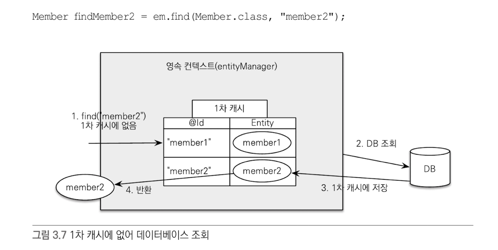
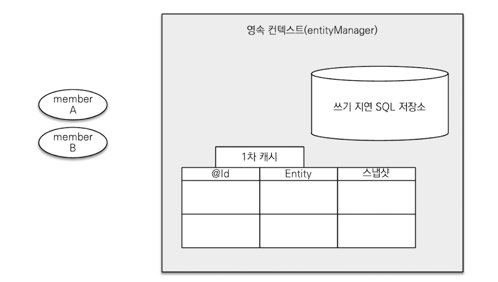

# 3장 영속성 관리

JPA가 제공하는 기능

- 엔티티와 테이블을 매핑하는 설계 부분
- 매핑한 엔티티를 실제 사용하는 부분

## 엔티티 매니저 팩토리와 엔티티 매니저

### 엔티티 매니저 팩토리

- 엔티티 매니저를 만드는 공장
- 공장을 만드는 비용은 상당히 크다.
- 한 개만 만들어서 애플리케이션 전체에서 공유하도록 설계
- 엔티티 매니저를 생성하는 비용은 거의 들지 않는다.
- 엔티티 매니저 팩토리는 여러 스레드가 동시에 접근해도 안전 → 서로 다른 스레드 간에 공유해도 된다.
- 엔티티 매니저는 여러 스레드가 동시에 접근하면 동시성 문제가 발생 → 스레드 간에 절대 공유 X
- 엔티티 매니저는 데이터베이스 연결이 꼭 필요한 시점까지 커넥션을 얻지 않는다.

## 영속성 컨텍스트란?

- ‘엔티티를 영구 저장하는 환경’
- 엔티티 매니저로 엔티티를 저장하거나 조회하면 엔티티 매니저는 영속성 컨텍스트에 엔티티를 보관하고 관리
- em.persist(member);
    - persist() 메소드는 엔티티 매니저를 사용해서 회원 엔티티를 영속성 컨텍스트에 저장
- 영속성 컨텍스트는 엔티티 매니저를 생성할 때 하나 만들어진다. 그리고 엔티티 매니저를 통해서 영속성 컨텍스트에 접근할 수 있고, 영속성 컨텍스트를 관리할 수 있다.

### 엔티티의 생명주기

- **비영속(new/transient) : 영속성 컨텍스트와 전혀 관계가 없는 상태**
    
    
    
    - 엔티티 객체를 생성
    - 순수한 객체 상태, 아직 저장하지 않음
    - 영속성 컨텍스트나 데이터베이스와 전혀 관련 없다.
- **영속(managed) : 영속성 컨텍스트에 저장된 상태**
    
    
    
    - 엔티티 매니저를 통해서 엔티티를 영속성 컨텍스트에 저장
    - 영속성 컨텍스트가 관리하는 엔티티를 영속 상태
    - 영속상태라는 것은 영속성 컨텍스트에 의해 관리된다는 뜻
    - em.find()나 JPQL을 사용해서 조회한 엔티티도 영속성 컨텍스트가 관리하는 영속상태
- **준영속(detached) : 영속성 컨텍스트에 저장되었다가 분리된 상태**
    
    
    
    - 영속성 컨텍스트가 관리하던 영속 상태의 엔티티를 영속성 컨텍스트가 관리하지 않으면 준영속 상태
    - em.detach()를 호출하면 된다. em.close()를 호출해서 영속성 컨텍스트를 닫거나, em.clear()를 호출해서 영속성 컨텍스트를 초기화해도 영속성 컨텍스트가 관리하던 영속 상태의 엔티티는 준영속 상태가 된다.
- **삭제(removed) : 삭제된 상태**
    
    
    
    - 엔티티를 영속성 컨텍스트와 데이터베이스에서 삭제

## 영속성 컨텍스트의 특징

- 영속성 컨텍스트와 식별자 값
    - 영속성 컨텍스트는 엔티티를 식별자 값(@Id로 테이블의 기본 키와 매핑한 값)으로 구분
    - 영속 상태는 식별자 값이 반드시 있어야 한다.
    - 식별자 값이 없으면 예외가 발생
- 영속성 컨텍스트와 데이터베이스 저장
    - JPA는 보통 트랜잭션을 커밋하는 순간 영속성 컨텍스트에 새로 저장된 엔티티를 데이터베이스에 반영
    - 이것을 플러시(flush)라 한다.
- 영속성 컨텍스트가 엔티티를 관리하면 얻는 장점
    - 1차 캐시
    - 동일성 보장
    - 트랜잭션을 지원하는 쓰기 지연
    - 변경 감지
    - 지연 로딩

### 엔티티 조회

- 영속성 컨텍스트는 내부에 캐시를 가지고 있다.
- 이것을 1차 캐시라 한다.
- 영속성 상태의 엔티티는 모두 이곳에 저장
- 영속성 컨텍스트 내부에 Map이 하나 있는데 키는 @Id로 매핑한 식별자고 값은 엔티티 인스턴스다.
    
    
    
    
    
- 첫 번째 그림을 실행하면 두 번째 그림처럼 1차 캐시에 회원 엔티티를 저장
    - 회원 엔티티는 아직 데이터베이스에 저장되지 않았다.
    - 1차 캐시의 키는 식별자 값이다.
    - 식별자 값은 데이터베이스 기본 키와 매핑되어 있다.
    - 영속성 컨텍스트에 데이터를 저장하고 조회하는 모든 기준은 데이터베이스 기본 키 값이다.
- 엔티티 조회
    
    
    
    - em.find()를 호출하면 먼저 1차 캐시에서 엔티티를 찾고
    만약 찾는 엔티티가 1차 캐시에 없으면 데이터베이스에서 조회

### 1차 캐시에서 조회

- em.find()를 호출하면 우선 1차 캐시에서 식별자 값으로 엔티티를 찾는다.
- 만약 찾는 엔티티가 있으면 데이터베이스를 조회하지 않고 메모리에 있는 1차 캐시에서 엔티티를 조회

### 데이터베이스에서 조회

- em.find()를 호출했는데 엔티티가 1차 캐시에 없으면
- 엔티티 매니저는 데이터베이스를 조회해서 엔티티를 생성
- 그리고 1차 캐시에 저장한 후 영속 상태의 엔티티를 반환
- em.find(Member.class, “member2”)를 실행
- member2가 1차 캐시에 없으므로 데이터베이스에서 조회
- 조회한 데이터로 member2 엔티티를 생성해서 1차 캐시에 저장한다. (영속 상태)
- 조회한 엔티티를 반환

### 영속 엔티티의 동일성 보장

- 다음 코드를 통해 식별자가 같은 엔티티 인스턴스를 조회해서 비교
    
    
    
- 참일까? 거짓일까?
    - em.find(Member.class, “member1”)를 반복해서 호출해도
    - 영속성 컨텍스트는 1차 캐시에 있는 같은 엔티티 인스턴스를 반환한다.
    - 둘은 같은 인스턴스고 결과는 당연히 참이다.
    - 영속성 컨텍스는 성능상 이점과 엔티티의 동일성을 보장한다.

<aside>

**동일성과 동등성**

- 동일성 (identity) : 실제 인스턴스가 같다. 따라서 참조 값을 비교하는 == 값이 같다.
- 동등성 (equality) : 실제 인스턴스는 다를 수 있지만 인스턴스가 가지고 있는 값이 같다.
    - 자바에서 동등성 비교는 equals() 메소드를 구현해야 한다.
</aside>

## 엔티티 등록

- 엔티티 매니저를 사용해서 엔티티를 영속성 컨텍스트에 등록해보자
    
    
    
- 엔티티 매니저는 트랜잭션을 커밋하기 직전까지 데이터베이스에 엔티티를 저장하지 않고 내부 쿼리 저장소에 INSERT SQL을 차곡차곡 모아둔다.
- 트랜잭션을 커밋할 때 모아둔 쿼리를 데이터베이스에 보낸다.
- 이것을 트랜잭션을 지원하는 쓰기 지연(transactional write-behind)이라 한다.
    
    
    
    
    
    
    
- 먼저 회원 A를 영속화, 영속성 컨텍스트는 1차 캐시에 회원 엔티티를 저장하면서 동시에 회원 엔티티 정보로 등록 쿼리를 만든다. 그리고 등록 쿼리를 쓰기 지연 SQL 저장소에 보관한다.
- 다음으로 회원 B를 영속화했다. 마찬가지로 회원 엔티티 정보로 등록 쿼리를 생성해서 쓰기 지연 SQL 저장소에 보관한다.
- 현재 쓰기 지연 SQL 저장소에는 등록 쿼리가 2건 저장되었다.
- 마지막으로 트랜잭션을 커밋한다.
- 트랜잭션을 커밋하면 엔티티 매니저는 우선 영속성 컨텍스트를 플러시한다.
- 플러시는 영속성 컨텍스트의 변경 내용을 데이터베이스에 동기화하는 작업
- 등록, 수정, 삭제한 엔티티를 데이터베이스에 반영한다.
    - 쓰기 지연 SQL 저장소에 모인 쿼리를 데이터베이스에 보낸다.
- 영속성 컨텍스트의 변경 내용을 데이터베이스에 동기화한 후에 실제 데이터베이스 트랜잭션을 커밋한다.

### 트랜잭션을 지원하는 쓰기 지연이 가능한 이유

- 다음 로직을 2가지 경우로 생각해보자
1. 데이터를 저장하는 즉시 등록 쿼리를 데이터베이스에 보낸다. 예제에서 save() 메소드를 호출할 때마다 즉시 데이터베이스에 등록 쿼리를 보낸다. 그리고 마지막에 트랜잭션을 커밋한다.
2. 데이터를 저장하면 등록 쿼리를 데이터베이스에 보내지 않고 메모리에 모아둔다. 그리고 트랜잭션을 커밋할 때 모아둔 등록 쿼리를 데이터베이스에 보낸 후에 커밋한다.
- 트랜잭션 범위 안에서 실행됨로 둘의 결과는 같다.
- A, B, C 모두 트랜잭션을 커밋하면 함께 저장, 롤백하면 함께 저장되지 않는다.
- 등록 쿼리를 그때 그떄 데이터베이스에 전달해도 트랜잭션을 커밋하지 않으면 아무 소용 없다.
- 이것이 트랜잭션을 지원하는 쓰기 지연이 가능한 이유
- 잘 활용하면 모아둔 등록 쿼리를 데이터베이스에 한 번에 전달해서 성능을 최적화할 수 있다.

### 엔티티 수정

- SQL 수정 쿼리의 문제점
    - SQL을 사용하면 수정 쿼리를 직접 작성
    - 프로젝트가 점점 커질수록 수정 쿼리도 점점 추가
    - 이런 개발 방식의 문제점은 수정 쿼리가 많아지는 것은 물론 비즈니스 로직을 분석하기 위해 SQL을 계속 확인
    - 직접적이든 간접적이든 비즈니스 로직이 SQL에 의존하게 된다.
- 변경 감지
    
    
    
    - JPA로 엔티티를 수정할 때는 단순히 엔티티를 조회해서 데이터만 변경하면 된다.
    - 트랜잭션 커밋 직전에  em.update() 메소드를 실행해야 할 것 같지만 이런 메소드는 없다.
    - 엔티티의 데이터만 변경했는데 어떻게 데이터베이스에 반영되는 걸까?
        - 엔티티의 변경사항을 데이터베이스에 자동으로 반영하는 기능을 변경 감지(dirty checking)라 한다.
        
        
        
    - JPA는 엔티티를 영속성 컨텍스트에 보관할 때, 최초 상태를 복사해서 저장해두는데 이것을 스냅샷이라고 한다.
    - 플러시 시점에 스냅샷과 엔티티를 비교해서 변경된 엔티티를 찾는다.
    - 그림 분석
        1. 트랜잭션을 커밋하면 엔티티 매니저 내부에서 먼저 플러시(flush())가 호출
        2. 엔티티와 스냅샷을 비교해서 변경된 엔티티를 찾는다.
        3. 변경된 엔티티가 있으면 수정 쿼리를 생성해서 쓰기 지연 SQL 저장소에 보낸다.
        4. 쓰기 지연 저장소의 SQL을 데이터베이스에 보낸다.
        5. 데이터베이스 트랜잭션을 커밋한다.
    - 변경 감지는 영속성 컨텍스트가 관리하는 영속 상태의 엔티티에만 적용된다.
    - 비영속, 준영속처럼 영속성 컨텍스트의 관리를 받지 못하는 엔티티는 값을 변경해도 데이터베이스에 반영되지 않는다.
    - JPA의 기본전략은 아래 예제 처럼 모든 필드를 업데이트한다.
        
        
        
        - 이렇게 모든 필드를 사용하면 데이터베이스에 보내는 데이터 전송량이 증가하는 단점이 있다.
        - 다음과 같은 장점으로 인해 모든 필드를 업데이트 한다.
            1. 모든 필드를 사용하면 수정 쿼리가 항상 같다. (물론 바인딩되는 데이터는 다르다.)
            따라서 애플리케이션 로딩 시점에 수정 쿼리를 미리 생성해두고 재사용할 수 있다.
            2. 데이터베이스에 동일한 쿼리를 보내면 데이터베이스는 이전에 한 번 파싱된 쿼리를 재사용할 수 있다.
            3. 필드가 만헉나 저장되는 내용이 너무 크면 수정된 데이터만 사용해서 동적으로 UPDATE SQL을 생성하는 전략을 선택하면 된다.
            이때 하이버네이트 확장 기능을 사용해야 한다.
                
                
                
                - org.hibernate.annotations.DynamicUpdate 어노테이션을 사용하면 수정된 데이터만 사용해서 동적으로 UPDATE SQL을 생성한다.

### 엔티티 삭제

- 엔티티를 삭제하려면 먼저 삭제 대상 엔티티를 조회
    
    
    
- em.remove()에 삭제 대상 엔티티를 넘겨주면 엔티티를 삭제한다.
- 엔티티를 즉시 삭제하는 것이 아니라 엔티티 등록과 비슷하게 삭제 쿼리를 → 쓰기 지연 SQL 저장소에 등록
- 트랜잭션을 커밋해서 플러시를 호출하면 실제 데이터베이스에 삭제 쿼리를 전달
- em.remove(memberA)를 호출하는 순간 memberA는 영속성 컨텍스트에서 제거
- 이렇게 삭제된 엔티티는 재사용하지 않고 자연스럽게 가비지 컬렉션의 대상이 되도록 두는 것이 좋다.

## 플러시

- 플러시(flush())는 영속성 컨텍스트의 변경 내용을 데이터베이스에 반영한다.
- 플러시를 실행하면 구체적으로 다음과 같은 일이 발생
    1. 변경 감지가 동작해서 영속성 컨텍스트에 있는 모든 엔티티를 스냅샷과 비교해서 수정된 엔티티를 찾는다.
    수정된 엔티티는 수정 쿼리를 만들어 → 쓰기 지연 SQL 저장소에 등록
    2. 쓰기 지연 SQL 저장소의 쿼리를 데이터베이스에 전송한다.
- 영속성 컨텍스트를 플러시하는 방법은 3가지
    1. em.flush()를 직접 호출
        - 테스트나 다른 프레임워크과 JPA를 함께 사용할 때를 제외하고 거의 사용하지 않는다.
    2. 트랜잭션 커밋 시 플러시가 자동 호출
        - 데이터베이스 변경 내용을 SQL로 전달하지 않고 트랜잭션만 커밋하면 어떤 데이터베이스도 데이터베이스에 반영되지 않는다.
        - 트랜잭션을 커밋하기 전에 꼭 플러시를 호출해서 영속성 컨텍스트의 변경 내용을 데이터베이스에 반영해야 한다.
        - JPA는 이런 문제를 예방하기 위해 트랜잭션을 커밋할 때 플러시를 자동으로 호출
    3. JPQL 쿼리 실행 시 플러시가 자동 호출
        - JPQL이나 Criteria 같은 객체지향 쿼리를 호출할 때도 플러시가 실행된다.
            
            
            
        - em.persist()를 호출해서 엔티티 memberA, B, C를 영속 상태로 만들었다.
        - 이 엔티티들은 영속성 컨텍스에는 있지만 아직 데이터베이스에는 반영되지 않았다.
        - 이때 JPQL을 실행하면? JPQL은 SQL로 변환되어 데이터베이스에서 엔티티를 조회한다.
        - 그런데 memberA, B, C는 아직 데이터베이스에 없으므로 쿼리 결과로 조회되지 않는다.
        - 따라서 쿼리를 실행하기 직전에 영속성 컨텍스트를 플러시해서 변경 내용을 데이터베이스에 반영해야 한다.
        - JPA는 예방하기 위해 플러시를 자동 호출한다.

### 플러시 모드 옵션

- 엔티티 매니저에 플러시 모드를 직접 지정하려면 javax.persistence.FlushModeType을 사용
    - FlushModeType.AUTO: 커밋이나 쿼리를 실행할 때 플러시
    - FlushModeType.COMMIT : 커밋할 때만 플러시
- 플러시라는 이름으로 인해 영속성 컨텍스트에 보관된 엔티티를 지운다고 생각하면 안된다.
- 영속성 컨텍스트의 변경 내용을 데이터베이스에 동기화하는 것이 플러시

## 준영속

- 영속성 컨텍스트가 관리하는 영속 상태의 엔티티가 영속성 컨텍스트에서 분리된(detached)것을 준영속 상태라 한다.
- 준영속 상태의 엔티티는 영속성 컨텍스트가 제공하는 기능을 사용할 수 없다.
- 영속 상태의 엔티티를 준영속 상태로 만드는 방법 3가지
    - em.detach(entity) : 특정 엔티티만 준영속 상태로 전환
    - em.clear() : 영속성 컨텍스트를 완전히 초기화
    - em.close() : 영속성 컨텍스트를 종료

### 엔티티를 준영속 상태로 전환 : detach()

- 먼저 회원 엔티티를 생성하고 영속화한 다음 em.detach(member)를 호출
- 영속성 컨텍스트에게 더는 해당 엔티티를 관리하지 말라는 것
- 이 메서드를 호출하는 순간 1차 캐시, 쓰기 지연 SQL 저장소까지 해당 엔티티를 관리하기 위한 모든 정보 제거
    
    
    
    
    
- 영속 상태였다가 더는 영속성 컨텍스트가 관리 하지 않는 상태를 준영속 상태라 한다.
- 영속 상태가 영속성 컨텍스트로부터 관리되는 상태
- 준영속 상태는 영속성 컨텍스트로부터 분리(detached)된 상태

### 영속성 컨텍스트 초기화 : clear()

- em.clear()는 해당 영속성 컨텍스트의 모든 엔티티를 준영속 상태로 만든다.
    
    
    
    
    
    
    

### 영속성 컨텍스트 종료 : close()

- 영속성 컨텍스트를 종료하면 해당 영속성 컨텍스트가 관리하던 영속 상태의 엔티티가 모두 준영속 상태가 된다.
    
    
    
    
    
    
    

### 준영속 상태의 특징

- 거의 비영속 상태에 가깝다.
    - 영속성 컨텍스트가 관리하지 않으므로 1차 캐시, 쓰기 지연, 변경 감지, 지연 로딩을 포함한 영속성 컨텍스트가 제공하는 어떠한 기능도 동작하지 않는다.
- 식별자 값을 가지고 있다.
    - 비영속 상태는 식별자 값이 없을 수도 있지만 준영속 상태는 이미 한 번 영속 상태였으므로 반드시 식별자 값을 가지고 있다.
- 지연 로딩을 할 수 없다.
    - 지연 로딩(LAZY LOADING)은 실제 객체 대신 프록시 객체를 로딩해두고 해당 객체를 실제 사용할 때 영속성 컨텍스트를 통해 데이터를 불러오는 방법
    - 준영속 상태는 영속성 컨텍스트가 더는 관리하지 않으므로 지연 로딩시 문제가 발생

### 병합 : merge()

- 준영속 사앹의 엔티티를 다시 영속 상태로 변경하려면 병합을 사용하면 된다.
- merge() 메소드는 준영속 상태의 엔티티를 받아서 그 정보로 새로운 영속 상태의 엔티티를 반환한다.
    
    
    

### 준영속 병합

1. merge()를 실행
2. 파라미터로 넘어온 준영속 엔티티의 식별자 값으로 1차 캐시에서 엔티티를 조회
    1. 만약 1차 캐시에 엔티티가 없으면 데이터베이스에서 엔티티를 조회하고 1차 캐시에 저장
3. 조회한 영속 엔티티(mergeMember)에 member 엔티티의 값을 채워 넣는다.
    1. member 엔티티의 모든 값을 mergeMember에 밀어 넣는다.
    2. mergeMember의 “회원1”이라는 이름이 “회원명변경”으로 바뀐다.
4. mergeMember를 반환한다.

- 병합이 끝나고 tx2.commit()을 호출해서 트랜잭션을 커밋했다.
- mergeMember의 이름이 “회원1”에서 “회원명변경”으로 변경되었으므로 변경 감지 기능이 동작
- 변경 내용을 데이터베이스에 반영
- merge()는 파라미터로 넘어온 준영속 엔티티를 사용해서 새롭게 병합된 영속 상태의 엔티티를 반환한다.
- 파라미터로 넘어온 엔티티는 병합 후에도 준영속 상태로 남아 있다.
- em.contains(entity)는 false, em.contains(mergeMember)는 true 반환하는 이유
- 준영속 상태인 member는 이제 사용할 필요가 없다.
- 준영속 엔티티를 참조하던 변수를 영속 엔티티를 참조하도록 변경하는 것이 안전
    
    
    

### 비영속 병합

- 병합은 비영속 엔티티도 영속 상태로 만들 수 있다.
    
    
    
- 병합은 파라미터로 넘어온 엔티티의 식별자 값으로 영속성 컨텍스트를 조회
- 찾는 엔티티가 없으면 데이터베이스에서 조회
- 데이터베이스에서도 발견하지 못하면 새로운 엔티티를 생성해서 병합
- 병합은 준영속, 비영속을 신경쓰지 않는다.
- 식별자 값으로 엔티티를 조회할 수 있으면 불러서 병합하고 조회할 수 없으면 새로 생성해서 병합
- 따라서 병합은 save or update 기능을 수행