# 5장 연관관계 매핑 기초

- 엔티티들은 대부분 다른 엔티티와 연관관계가 있다.
- 객체는 참조(주소)를 사용해서 관계를 맺고 테이블은 외래 키를 사용해서 관계를 맺는다.
- 객체 관계 매핑(ORM)에서 가장 어려운 부분이 바로 객체 연관관계와 테이블 연관관계를 매핑하는 일
- 객체의 참조와 테이블의 외래 키를 매핑하는 것이 이 장의 목표

- **방향 (Direction)**
    - 단방향, 양방향
    - 둘 중 한 쪽만 참조하는 것을 단방향
    - 양쪽 모두 서로 참조하는 것을 양방향
    - 방향은 객체관계에만 존재, 테이블 관계는 항상 양방향
- **다중성 (Multiplicity)**
    - 다대일, 일대다, 일대일, 다대다, 다중성이 있다.
- **연관관계의 주인(Owner)**
    - 객체를 양방향 연관관계로 만들면 연관관계의 주인을 정해야 한다.

## 단방향 연관관계

- 회원과 팀이 있다.
- 회원은 하나의 팀에만 소속될 수 있다.
- 회원과 팀은 다대일 관계이다.
    
    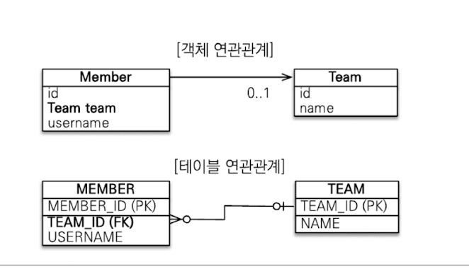
    
- 객체 연관관계
    - 회원 객체는 Member.team 필드(멤버변수)로 팀 객체와 연관관계를 맺는다.
    - 회원 객체와 팀 객체는 단방향 관계다.
        - 회원은 Member.team 필드를 통해서 팀을 알 수 있지만 반대로 팀은 회원을 알 수 없다.
- 테이블 연관관계
    - 회원 테이블은 TEAM_ID 외래 키로 팀 테이블과 연관관계를 맺는다.
    - 회원 테이블과 팀 테이블은 양방향 관계다.
    - 회원 테이블의 TEAM_ID 외래 키를 통해서 회원과 팀을 조인할 수 있고
    반대로 팀과 회원도 조회할 수 있다.
    - 외래 키 하나로 양방향 조인
        
        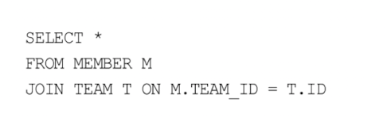
        
        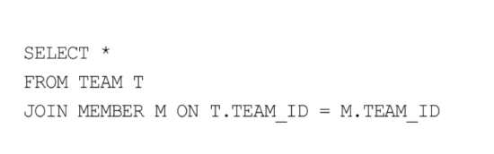
        
- 객체 연관관계와 테이블 연관관계의 가장 큰 차이
    - 참조를 통한 연관관계는 언제나 단방향
    - 객체간에 연관관계를 양방향으로 만들고 싶으면 반대쪽에도 필드를 추가해서 참조를 보관해야 한다.
    - 결국 연관관계를 하나 더 만들어야 한다.
    - 양쪽에서 서로 참조하는 것을 양방향 연관관계라고 한다.
    - 양방향 관계가 아니라 서로 다른 단방향 관계 2개다.
        
        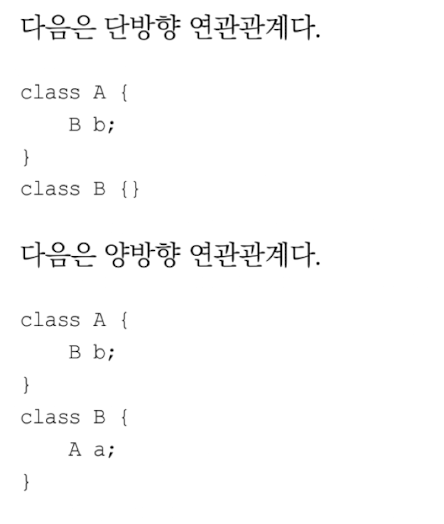
        
- 객체 연관관계 vs 테이블 연관관계 정리
    - 객체는 참조(주소)로 연관관계를 맺는다.
    - 테이블은 외래 키로 연관관계를 맺는다.
    - 연관된 데이터를 조회할 때
        - 객체는 참조(a.getB().getC())를 사용
        - 테이블은 조인을 사용
    - 참조를 사용하는 객체의 연관관계는 단방향
        - A→B(a, b)
    - 외래 키를 사용하는데 테비을의 연관관계는 양방향
        - A JOIN B 가능하면 반대로 B JOIN A도 가능
    - 객체를 양방향으로 참조하려면 단방향 연관관계를 2개 만들어야 한다.
        - A → B (a.b)
        - B → A (b.a)

### 순수한 객체 연관관계

- JPA를 사용하지 않은 순수한 회원과 팀 클래스 코드
    
    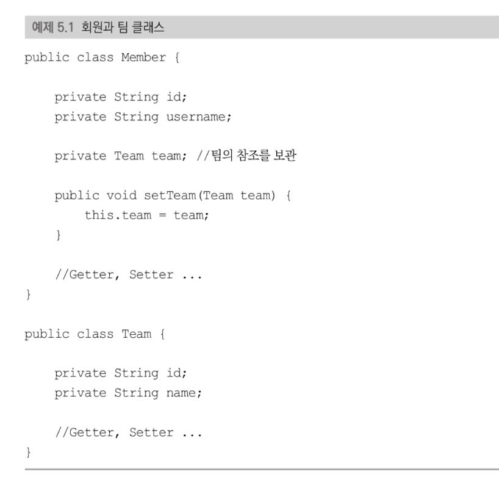
    
- 회원1과 회원2를 팀1에 소속시키는 코드
    
    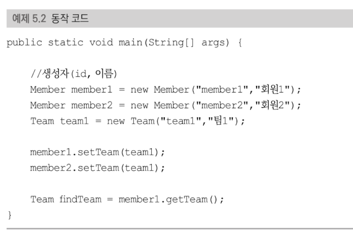
    
    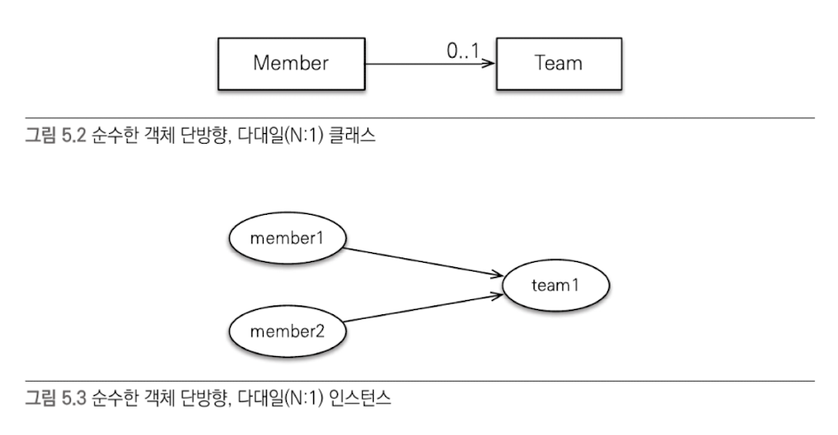
    
    - 다음 코드로 회원1이 속한 팀1을 조회할 수 있다.
        
        ```java
        Team findTeam = member1.getTeam();
        ```
        
    - 이처럼 객체는 참조를 사용해서 연관관계를 탐색할 수 있는데
    - 이것을 객체 그래프 탐색이라고 한다.

### 테이블 연관관계

- 데이터베이스 테이블의 회원과 팀의 관계를 살펴보자
    
    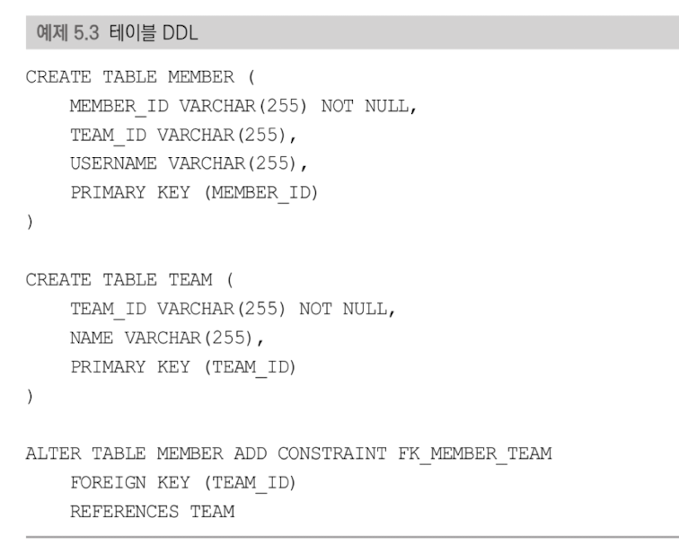
    
    - 회원1과 회원2를 팀1에 소속 시키는 SQL
        
        ```sql
        INSERT INTO TEAM(TEAM_ID, NAME_ VALUES('team1', '팀1');
        INSERT INTO MEMBER(MEMBER_ID, TEAM_ID, USERNAME)
        VALUES('member1', 'team1', '회원1');
        INSERT INTO MEMBER(MEMBER_ID, TEAM_ID, USERNAME)
        VALUES('member2', 'team1', '회원2');
        ```
        
    - 회원1이 소속된 팀을 조회
        
        ```sql
        SELECT T.*
        FROM MEMBER M
        		JOIN TEAM T ON M.TEAM_ID = T.ID
        WHERE M.MEMBER_ID = 'member1';
        ```
        
    - 데이터베이스는 외래 키를 사용해서 연관관계를 탐색할 수 있는데 이것을 조인이라 한다.

### 객체 관계 매핑

- JPA를 사용해서 둘을 매핑해보자
    
    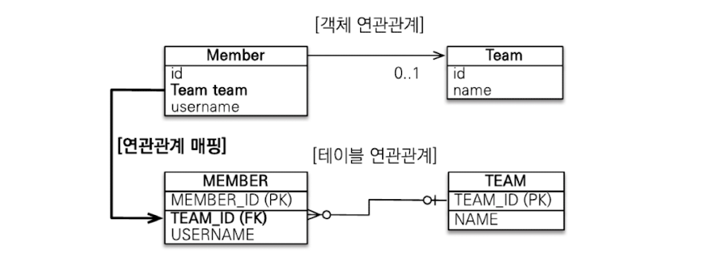
    
    - 매핑한 회원 엔티티
        
        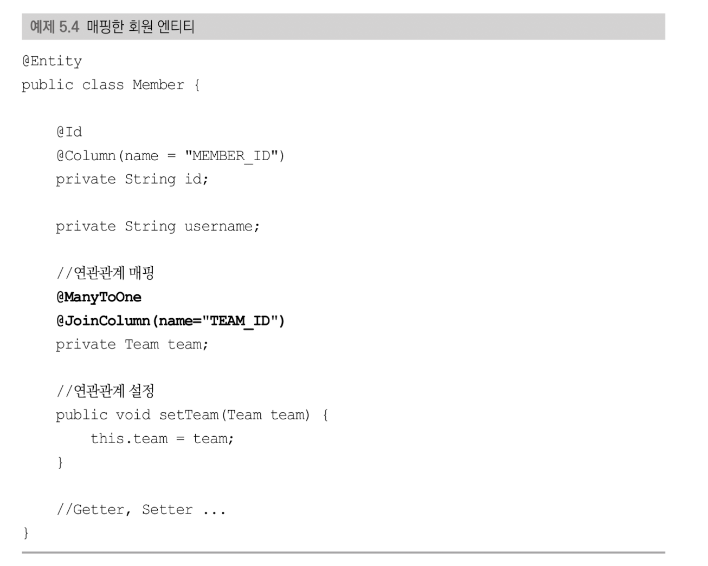
        
        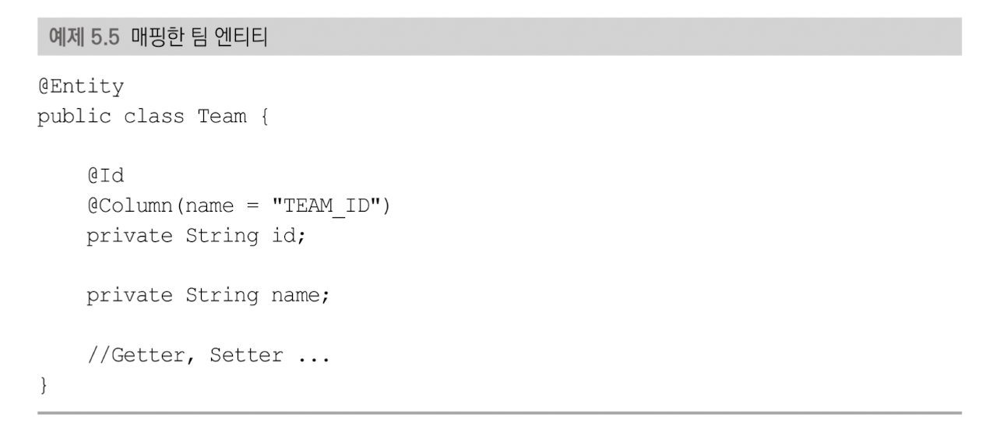
        
    - 객체 연관관계 : 회원 객체의 Member.team 필드 사용
    - 태이블 연관관계 : 회원 테이블의 MEMBER.TEAM_ID 외래 키 컬럼을 사용
    - Member.team과 MEMBER.TEAM_ID를 매핑하는 것이 연관관계 매핑
    
    ```java
    @ManyToOne
    @JoinColumn(name = "TEAM_ID")
    private Team team;
    ```
    
    회원 엔티티에 있는 연관관계 매핑 부분이데 연관관계를 매핑하기 위한 어노테이션
    
    - ManyToOne
        - 이름 그대로 다대일(N:1) 관계라는 매핑 정보
        - 연관관계를 매핑할 때 다중성을 나타내는 어노테이션을 필수로 사용
    - @JoinColumn(name=”TEAM_ID”)
        - 조인 컬럼은 왜래 키를 매핑할 때 사용
        - name 속성에는 매핑할 때 외래 키 이름을 지정한다.
        - 회원과 팀 테이블은 TEAM_ID 외래 키로 연관관계를 맺으므로 이 값을 지정하면 된다.
        - 생략 가능

### @JoinColumn

- @JoinColumn은 외래 키를 매핑할 때 사용
    
    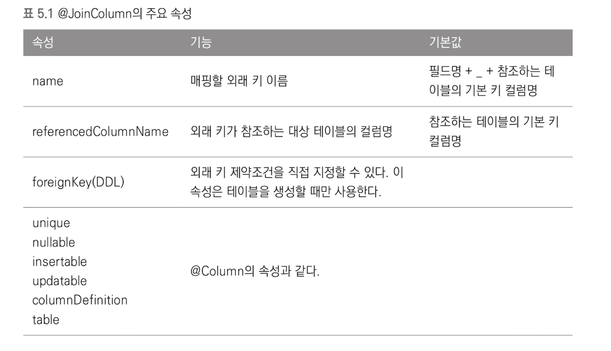
    
- @JoinColumn 생략
    - 기본 전략 : 필드명 +_+ 참조하는 테이블의 컬럼명
    - 필드명 (team) +_(밑줄) + 참조하는 테이블의 컬럼명
    (TEAM_ID) = team_TEAM_ID 외래 키를 사용한다.

### @ManyToOne

- 다대일 관계에서 사용
    
    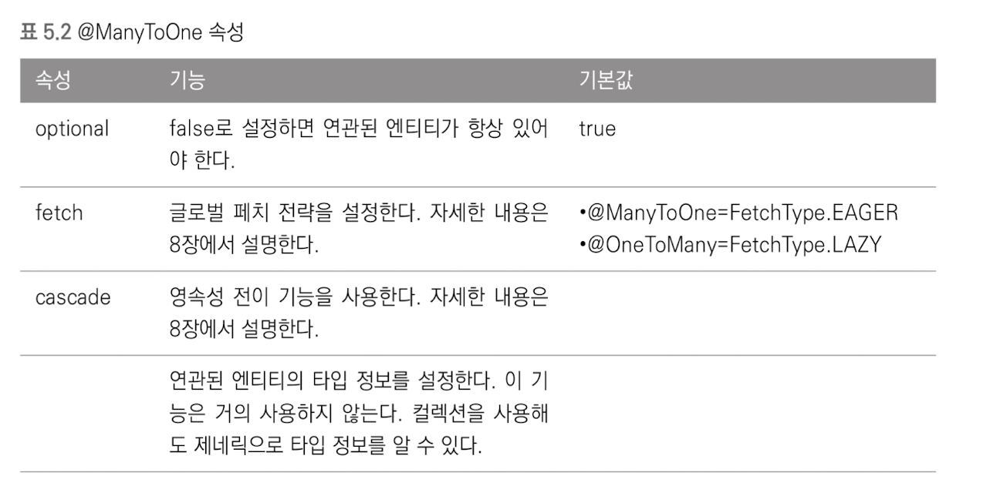
    
- targetEntity 속성의 사용 예
    
    ```java
    @OneToMany
    private List<Member> members; // 제네릭으로 타입 정보를 알 수 있다.
    
    @OneToMany(targetEntity = Member.class)
    private List members; // 제네릭이 없으면 타입 정보를 알 수 없다.
    ```
    

## 연관관계 사용

- 연관관계를 등록, 수정, 삭제, 조회하는 예제를 통해 연관관계를 어떻게 사용하는지 알아보자

### 저장

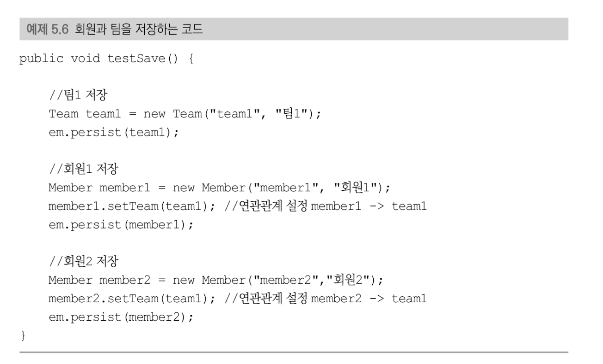

- JPA에서 엔티티를 저장할 때 연관된 모든 엔티티는 영속 상태여야 한다.

```java
member1.setTeam(team1); // 회원 -> 팀 참조
em.persist(member1); // 저장
```

- 회원 엔티티는 팀 엔티티를 참조하고 저장
- JPA는 참조한 팀의 식별자(Team.id)를 외래 키로 사용해서 적절한 등록 쿼리를 생성한다.
- SQL을 보면 회원 테이블의 외래 키 값으로 참조한 팀의 식별자 값인 team1이 입력된 것을 확인할 수 있다.

```java
INSERT INTO TEAM (TEAM_ID, NAME) VALUES ('team1', '팀1')
INSERT INTO MEMBER (MEMBER_ID, NAME, TEAM_ID) VALUES ('member1', '회원1', 'team1')
INSERT INTO MEMBER (MEMBER_ID, NAME, TEAM_ID) VALUES ('member2', '회원2', 'team1')
```

### 조회

- 연관관계가 있는 엔티티를 조회하는 방법
    - 객체 그래프 탐색(객체 연관관계를 사용한 조회)
        - member.getTeam()을 사용해서 member와 연관된 team 엔티티를 조회
        
        ```java
        Member member = em.find(Member.class, "member1");
        Team team = member.getTeam(); // 객체 그래프 탐색
        System.out.println("팀 이름 = " + team.getName());
        ```
        
        - 객체를 통해 연관된 엔티티를 조회하는 것을 객체 그래프 탐색
    - 객체지향 쿼리 사용(JPQL)
        - 회원을 대상으로 조회하는데 팀1에 소속된 회원만 조회하려면 회원과 연관된 엔티티를 검색 조건으로 사용해야 한다.
        - SQL은 연관된  테이블을 조인해서 검색조건을 사용하면 된다.
        - JPQL도 조인을 지원한다.
            
            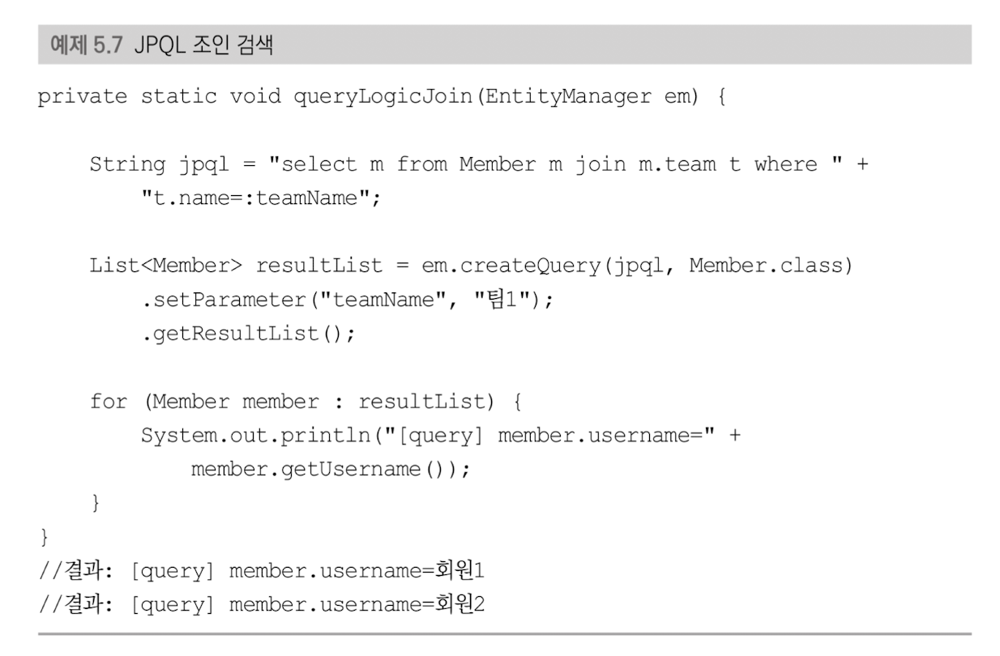
            
        - JPQL의 form Member m join m.team t 부분을 보면 회원이 팀과 관계를 
        가지고 있는 필드(m.team)를 통해서 Member와 Team을 조인했다.
        - where 절을 보면 조인한 t.name을 검색조건으로 사용해서 팀1에 속한 회원만 검색했다.
        
        ```java
        select m from Member m join m.team t where t.name =: teamName
        ```
        
        - :teamName과 같이 :로 시작하는 것은 파라미터를 바인딩받는 문자
        - 아래 SQL 구문과 같다.
            
            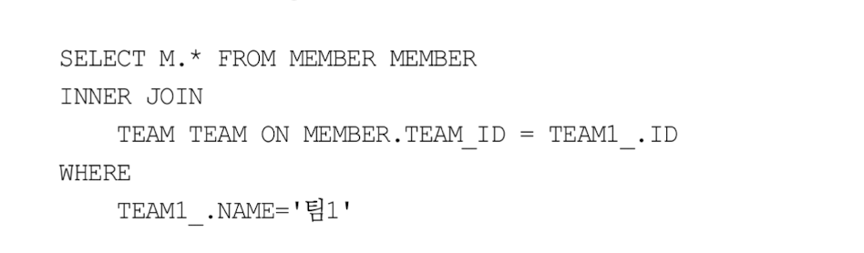
            

### 수정

- 팀1 소속이던 회원을 새로운 팀2에 소속하도록 수정해보자.
    
    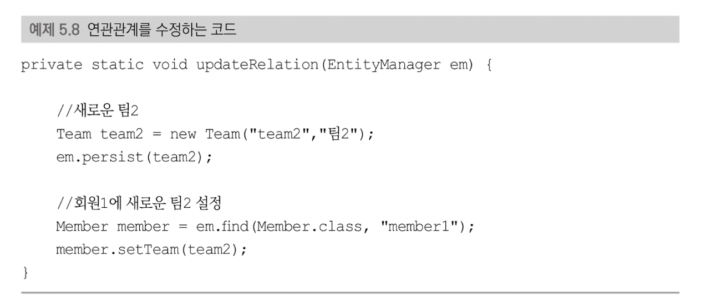
    
    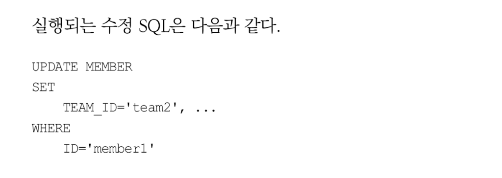
    
    - 수정은 em.update() 같은 메소드가 없다.
    - 단순히 불러온 엔티티의 값만 변경해두면 트랜잭션을 커밋할 때 플러시가 일어나면서 변경 감지 기능이 작동한다.
    - 변경사항을 데이터베이스에 자동으로 반영한다.
    - 연관관계를 수정할 때도 같은데, 참조하는 대상만 변경하면 나머지는 JPA가 자동으로 처리한다.

### 연관관계 제거

- 회원1을 팀에 소속하지 않도록 변경하자.
    
    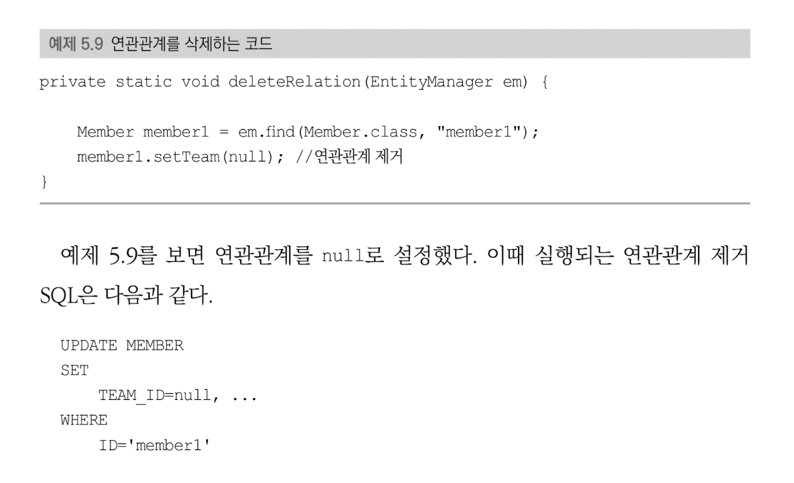
    

### 연관된 엔티티 삭제

- 기존에 있던 연관관계를 먼저 제거하고 삭제해야 한다.
- 그렇지 않으면 외래 키 제약조건으로 인해, 데이터베이스에서 오류가 발생한다.
- 팀1에는 회원1과 회원2가 소속되어 있다. 이때 팀1을 삭제하려면 연관관계를 먼저 끊어야 한다.
    
    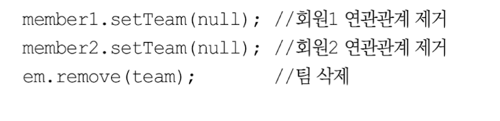
    

## 양방향 연관관계

- 팀에서 회원으로 접근하는 관계를 추가하자.
- 회원에서 팀으로 접근하고 반대 방향인 팀에서도 회원으로 접근할 수 있도록 양방향 연관관계로 매핑해보자.
    
    
    
    - 회원과 팀은 다대일 관계
    - 팀과 회원은 일대다 관계
    - 일대다 관계는 여러 건과 연관관계를 맺을 수 있으므로 컬렉션을 사용해야 한다.
    - Team.members를 List 컬렉션으로 추가했다.
    - 회원 → 팀 (Member.team)
    - 팀 → 회원(Team.members)
- 데이터베이스 테이블은 외래 키 하나로 양방향으로 조회할 수 있다.
    
    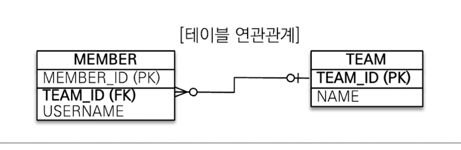
    
- 데이터베이스에 추가할 내용은 전혀 없다.
- TEAM_ID 외래 키를 사용해서 MEMBER JOIN TEAM이 가능하고 반대로 TEAM JOIN MEMBER도 가능하다.

### 양방향 연관관계 매핑

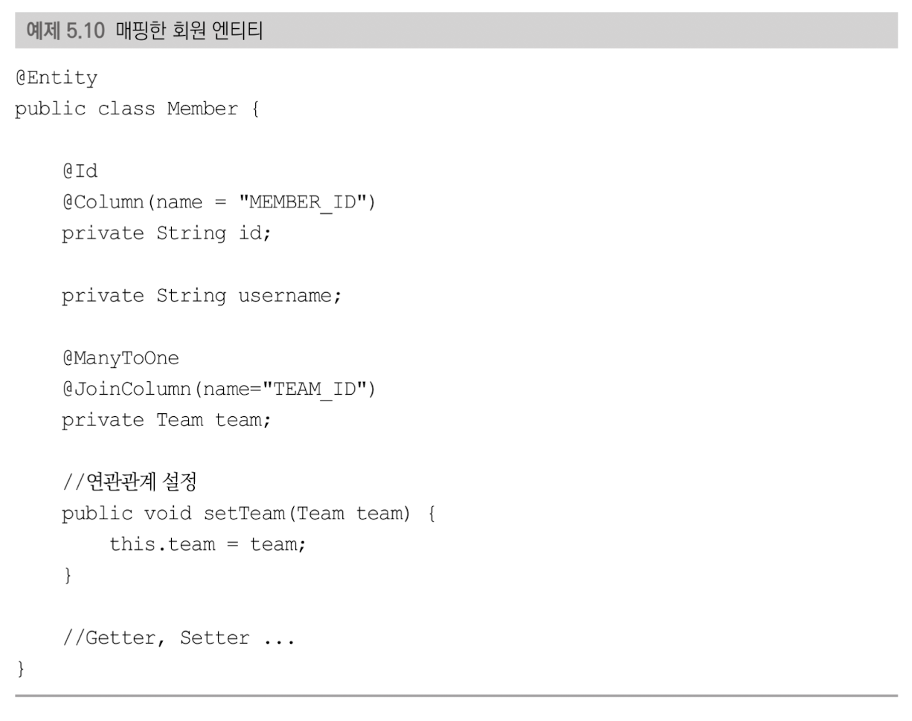

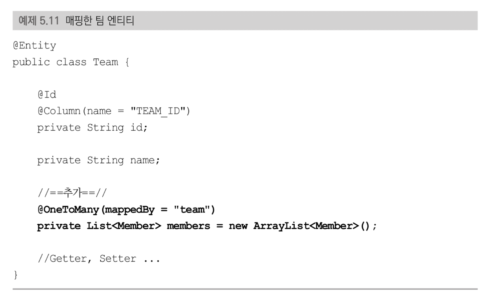

- 팀과 회원은 일대다 관계
- 팀 엔티티에 컬렉션인 List<Member> members를 추가했다.
- 일대다 관계를 매핑하기 위해 @OneToMany 매핑 정보를 사용했다.
- mappedBy 속성은 양방향 매핑일 때 사용하는데 반대쪾 매핑의 필드 이름을 값으로 주면 된다.
- 반대쪽 매핑이 Member.team이므로 team을 값으로 주었다.
- 팀에서 회원 컬렉션으로 객체 그래프를 탐색할 수 있다.

### 일대다 컬렉션 조회

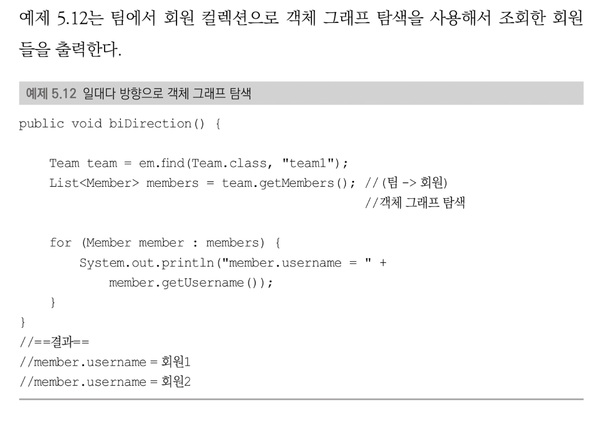

## 연관관계의 주인

- @OneToMany는 직관적으로 이해가 될 것이다.
- 문제는 mappedBy 속성이다. 왜 필요할까?
    - 객체에는 양방향 연관관계라는 것이 없다.
    - 서로 다른 단방향 연관관계 2개를 애플리케이션 로직으로 잘 묶어서 양방향인 것처럼 보이게할 뿐
    - 데이터베이스 테이블은 외래 키 하나로 양쪽이 서로 조인할 수 있다. 따라서 테이블은 외래 키 하나만으로 양방향 연관관계를 맺는다.
- 객체 연관관계
    - 회원 → 팀 연관관계 1개 (단방향)
    - 팀 → 회원 연관관계 1개 (단방향)
- 테이블 연관관계
    - 회원 ↔ 팀의 연관관계  1개 (양방향)
- 테이블은 외래 키 하나로 두 테이블의 연관관계를 관리
- 엔티티를 단방향으로 매핑하면 참조를 하나만 사용
    - 회원 → 팀, 팀 → 회원 두 고셍서 서로를 참조
- 엔티티를 양방향 연관관계로 설정하면 객체의 참조는 둘인데 외래 키는 하나다.
따라서 둘 사이에 차이가 발생
- 둘 중 어떤 관계를 사용해서 외래 키를 관리해야 할까?
    - 두 객체 연관관계 중 하나를 정해서 테이블의 외래 키를 관리해야 하는데 이것을 연관관계의 주인(Owner)이라 한다.

### 양방향 매핑의 규칙 : 연관관계의 주인

- 연관관계의 주인만이 데이터베이스 연관관계와 매핑되고 외래 키를 관리(등록, 수정, 삭제) 할 수 있다. 주인이 아닌 쪽은 읽기만 할 수 있다.
- mappedBy 속성을 사용하여 어떤 연관관계를 주인으로 정할지 사용
- 주인은 mappedBy 속성을 사용하지 않는다.
- 주인이 아니면 mappedBy 속성을 사용해서 속성의 값으로 연관관계의 주인을 지정해야 한다.
    
    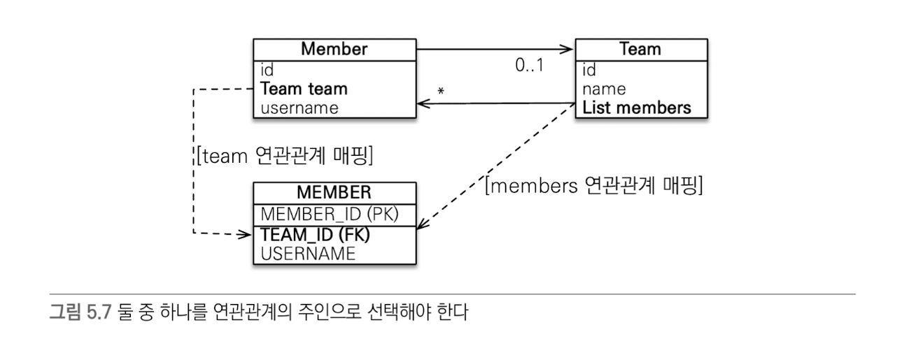
    
    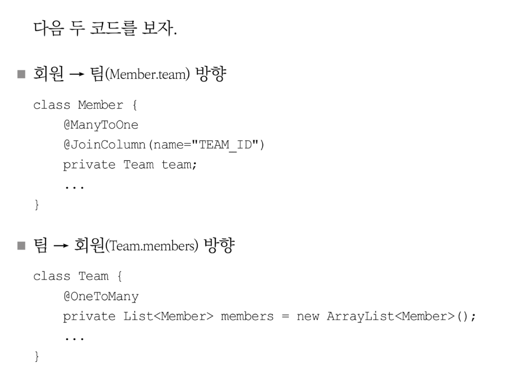
    
    - 연관관계의 주인을 정한다는 것은 사실 외래 키 관리자를 선택하는 것
    - 여기서는 회원 테이블에 있는 TEAM_ID 외래 키를 관리할 관리자를 선택해야 한다.
    - 회원 엔티티에 있는 Member.team을 주인으로 선택하면 자기 테이블에 있는 외래 키를 관리하면 된다.
    - 하지만 팀 엔티티에 있는 Team.members를 주인으로 선택하면 물리적으로 전혀 다른 테이블의 외래 키를 관리해야 한다.
    - 이 경우 Team.members가 있는 Team 엔티티는 TEAM 테이블에 매핑되어 있는데 관리해야할 외래 키는 MEMBER 테이블에 있기 때문이다.

### 연관관계 주인은 외래 키가 있는 곳

- 연관관계 주인은 테이블에 외래 키가 있는 곳으로 정해야 한다.
- 회원 테이블이 외래 키를 가지고 있으므로 Member.team이 주인이 된다.
- 주인이 아닌 Team.members에는 mappedBy = “team” 속성을 사용해서 주인이 아님을 설정한다.
- mappedBy 속성의 값으로는 연관관계의 주인인 team을 주면 된다. 여기서 mappedBy의 값으로 사용된 team은 연관관계의 주인인 Member 엔티티의 team 필드를 말한다.
    
    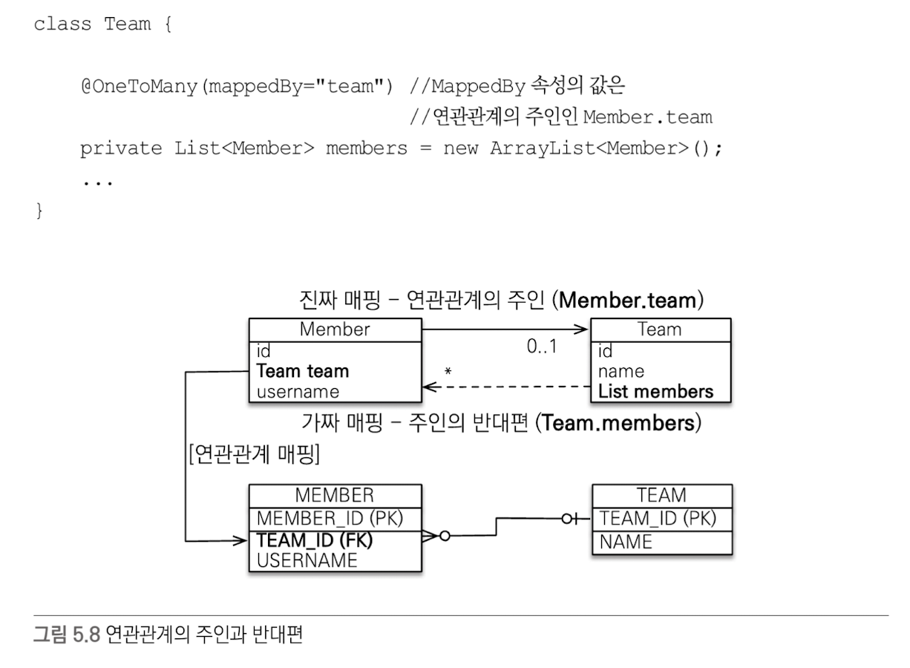
    
- 연관관계의 주인만 데이터베이스 연관관계와 매핑되고 외래 키를 관리할 수 있다.
- 주인이 아닌 반대편(inverse, non-owning side)은 읽기만 가능하고 외래 키를 변경하지는 못한다.
    
    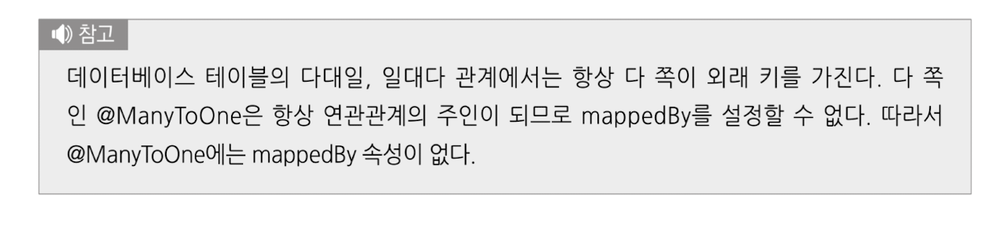
    

## 양방향 연관관계 저장

- 양방향 연관관계를 사용해서 팀1, 회원1, 회원2를 저장해보자.
    
    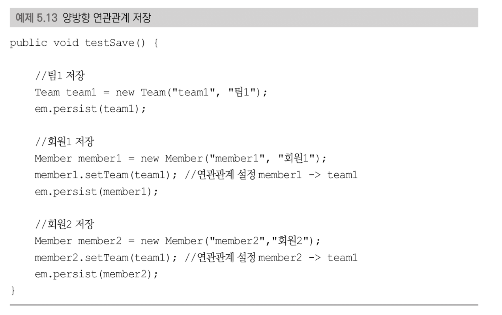
    
- 회원1, 회원2에 연관관계의 주인인 Member.team필드를 통해서 회원과 팀의 연관관계를 설정하고 저장했다.
- 이 코드는 단방향 연관관계에서 살펴본 예제 5.6의 회원과 팀을 저장하는 코드와 완전히 같다.
- 회원 테이블을 조회한 결과
    
    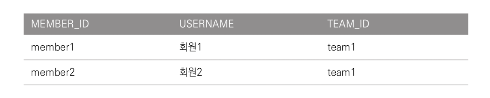
    
    - TEAM_ID 외래 키에 팀의 기본 키 값이 저장되어 있다.
    - 양방향 연관관계는 연관관계의 주인이 외래 키를 관리한다.
    - 주인이 아닌 방향은 값을 설정하지 않아도 데이터베이스에 외래 키 값이 정상 입력된다.
        
        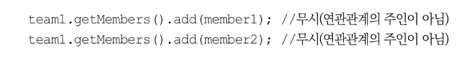
        
    - 이런 코드가 추가로 있어야 할 것 같지만 Team.members는 연관관계의 주인이 아니다.
    - 주인이 아닌 곳에 입력된 값은 외래 키에 영향을 주지 않는다.
    
    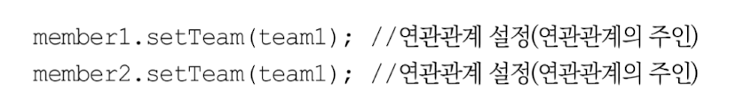
    
    - Member.team은 연관관계의 주인이다. 엔티티 매니저는 이곳에 입력된 값을 사용해서 외래 키를 관리한다.

## 양방향 연관관계의 주의점

- 양방향 연관관계를 설정하고 가장 흔히 하는 실수
    - 연관관계의 주인에는 값을 입력하지 않고, 주인이 아닌 곳에만 값을 입력하는 것
    - 데이터베이스에 외래 키 값이 정상적으로 저장되지 않으면 이것부터 의심
- 주인이 아닌 곳에만 값을 설정하면 어떻게 될까?
    
    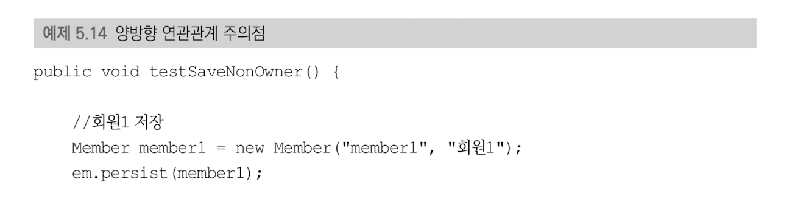
    
    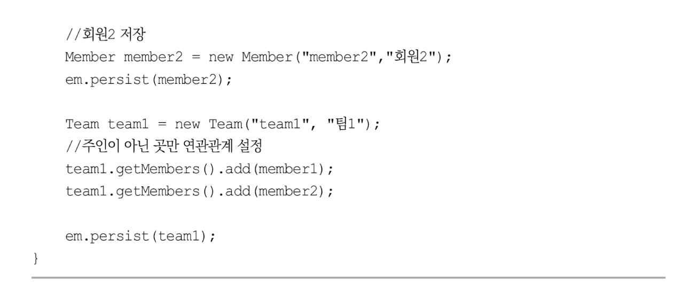
    
    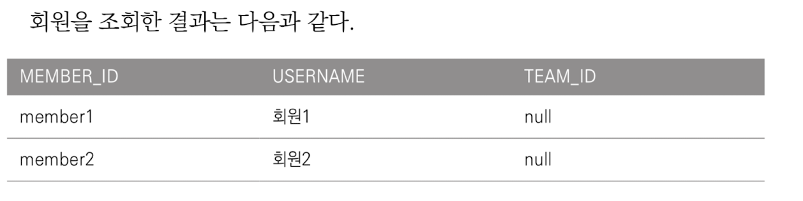
    
    - 외래 키 TEAM_ID에 team1이 아닌 null 값이 입력되어 있다.
    - 연관관계의 주인이 아닌 Team.members에만 값을 저장했기 때문
    - 연관관계의 주인만이 외래 키의 값을 변경할 수 있다.
    - 예제 코드는 연관관계의 주인인 Member.team에 아무 값도 입력하지 않았다.
    따라서 TEAM_ID 외래 키의 값도 null이 저장

### 순수한 객체까지 고려한 양방향 연관관계

- 정말 연관관계의 주인에만 값을 저장하고 주인이 아닌 곳에는 값을 저장하지 않아도 될까?
- 객체 관점에서 양쪽 방향에 모두 값을 입력해주는 것이 가장 안전
- 양쪽 방향 모두 값을 입력하지 않으면 JPA를 사용하지 않는 순수한 객체 상태에서 심각한 문제가 발생할 수 있다.
- JPA를 사용하지 않고 에티티에 대한 테스트 코드를 작성한다고 가정
- ORM은 객체와 관계형 데이터베이스 둘 다 주용하다.
- 데이터베이스뿐만 아니라 객체도 함께 고려해야 한다.
    
    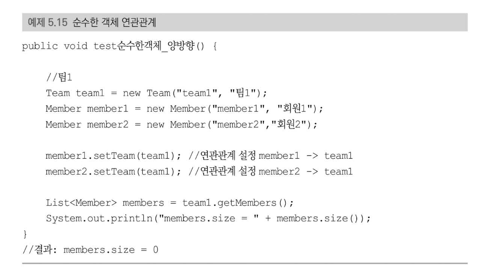
    
    - JPA를 사용하지 않는 순수한 객체
    - Member.team에만 연관관계를 설정하고 반대 방향은 연관관계를 설정하지 않았다.
    - 팀에 소속된 회원이 몇 명인지 출력해보면 결과는 0이 나온다.
        
        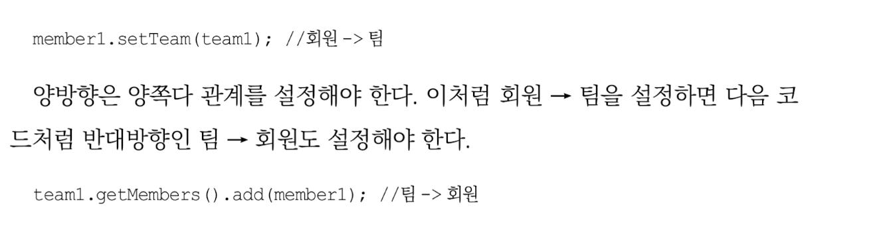
        
- 양방향 모두 관계를 설정
    
    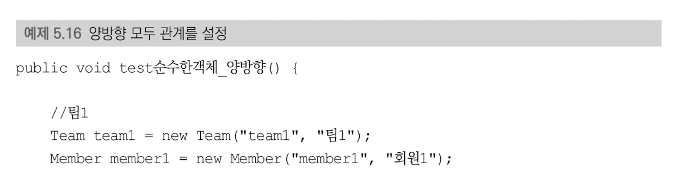
    
    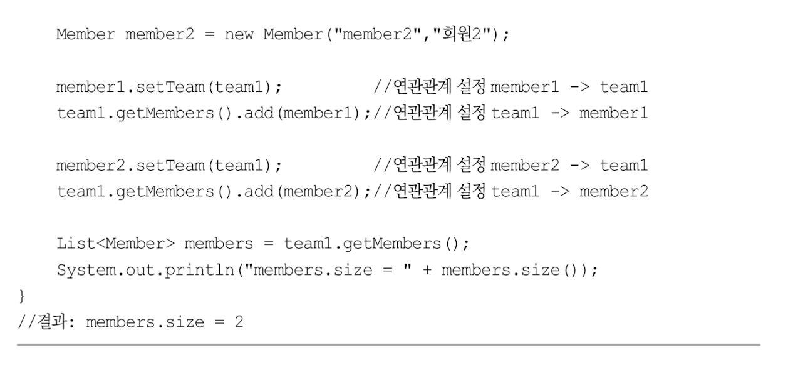
    
    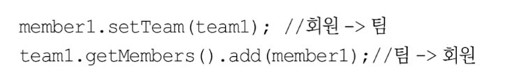
    
- 객체까지 고려하면 이렇게 양족 다 관계를 맺어야 한다.
- JPA로 코드 완성
    
    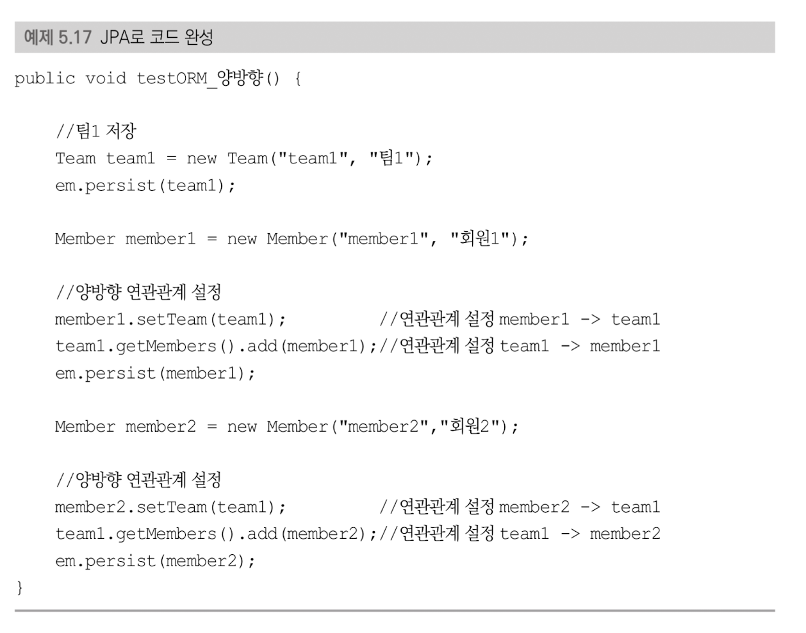
    
    - 양쪽에 연관관계를 설정
    - 순수한 객체 상태에서도 동작
    - 테이블의 외래 키도 정상 입력
    - 물론 외래 키의 값은 연관관계의 주인인 Member.team 값을 사용
        
        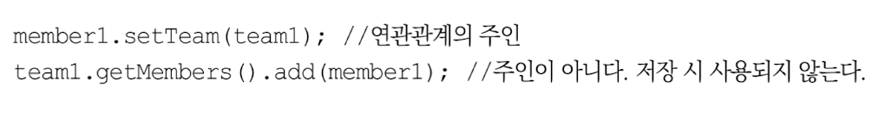
        
    - Member.team: 연관관계의 주인, 이 값으로 외래 키를 관리한다.
    - Team.members: 연관관계의 주인이 아니다. 따라서 저장 시에 사용되지 않는다.
- 객체까지 고려해서 주인이 아닌 곳에도 값을 입력하자.
- 결론 : 객체의 양방향 연관관계는 양쪽 모두 관계를 맺어줘야 한다.

### 연관관계 편의 메소드

- 양방향 연관관계는 결국 양쪽 다 신경 써야 한다.
- 다음처럼 member.setTeam(team)과 team.getMembers().add(member)를 각각 호출하다 보면 실수로 둘 중 하나만 호출해서 양방향이 깨질 수 있다.
    
    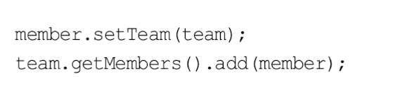
    
- 양방향 관계에서 두 코드는 하나인 것처럼 사용하는 것이 안전
- Member 클래스의 setTeam() 메소드를 수정해서 코드를 리팩토링해보자.
    
    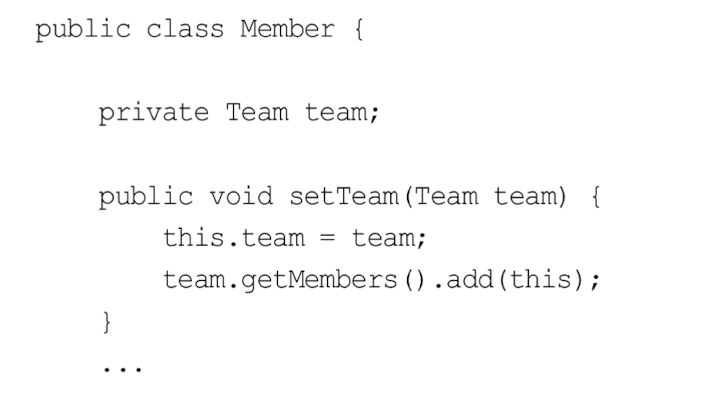
    
- setTeam() 메소드 하나로 양방향 관계를 모두 설정하도록 변경
- 연관관계를 설정하는 부분을 수정하자.
    
    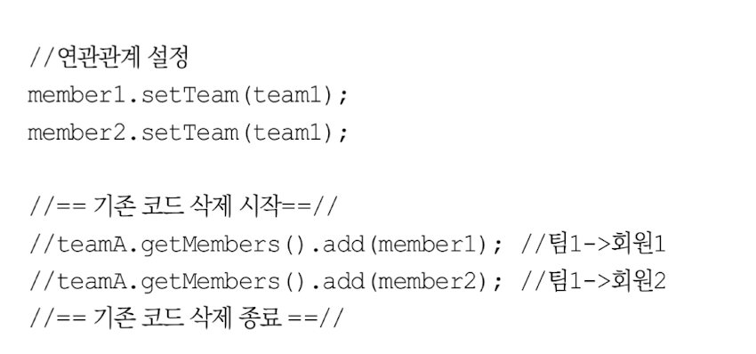
    
- 이렇게 리팩토링하면 실수도 줄어들고 좀 더 그럴듯하게 양방향 연관관계를 설정할 수 있다.
- 양방향 리팩토링 전체코드
    
    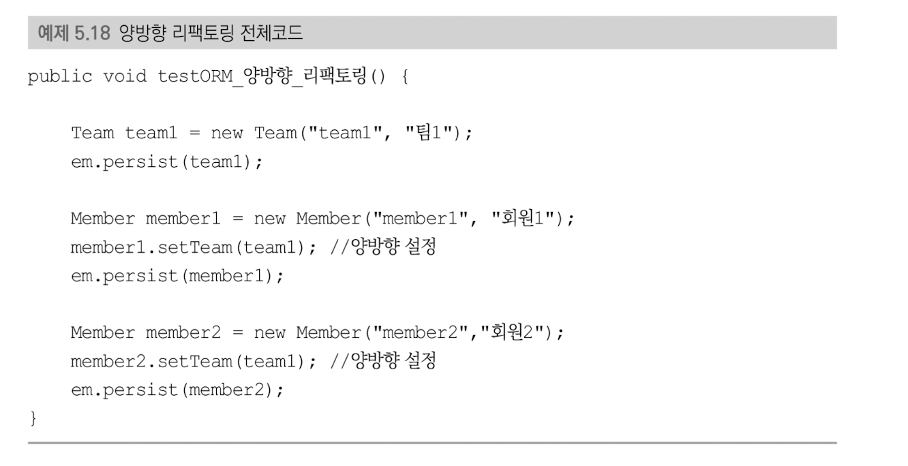
    
    - 한 번에 양방향 관계를 설정하는 메소드를 연관관계 편의 메소드라 한다.

### 연관관계 편의 메소드 작성 시 주의사항

- 사실 setTeam() 메소드에는 버그가 있다.(리팩토링 전에도 버그는 있었다.)
    
    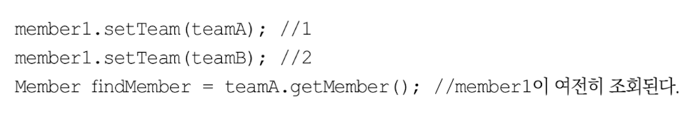
    
- 이 시나리오를 그림으로 분석
    - 먼저 member1.setTeam(teamA)를 호출한 직후 객체 연관관계인 그림을 보자.
    
    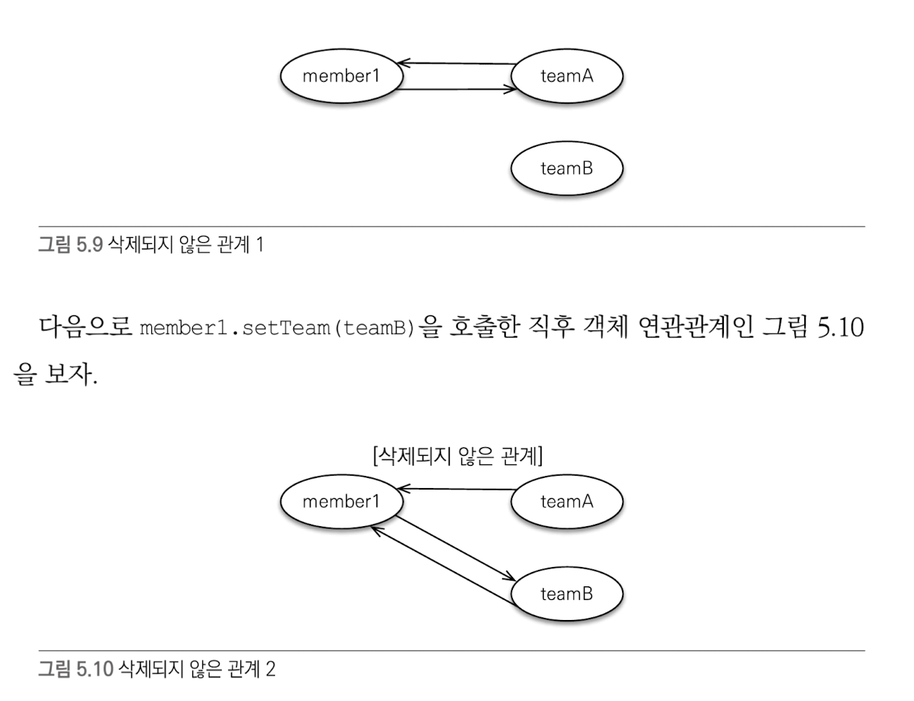
    
- teamB로 변경할 때 teamA → member1 관계를 제거하지 않았다.
- 연관관게를 변경할 때는 기존 팀이 있으면 기존 팀과 회원의 연관관계를 삭제하는 코드를 추가해야 한다.
- 기존 관계를 제거하도록 코드를 수정해야 한다.
    
    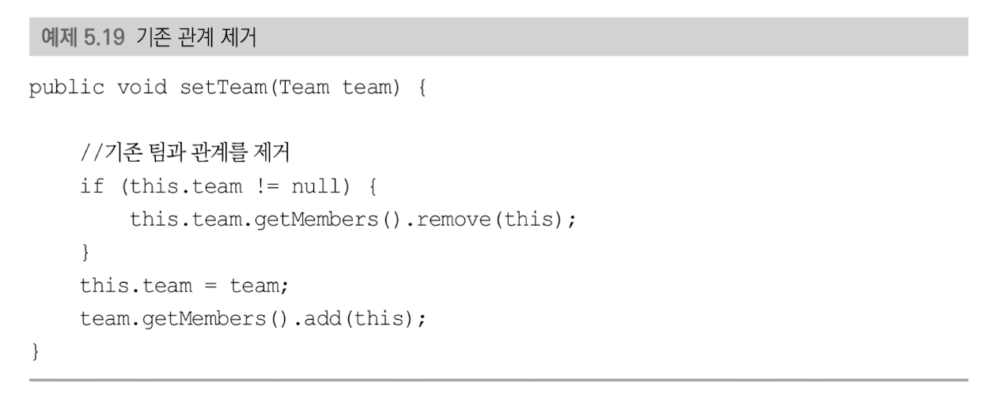
    
- 이 코드는 객체에서 서로 다른 단방향 연관관계 2개를 양방향인 것처럼 보이게 하려고 얼마나 많은 고민과 수고가 필요한지 보여준다.
- 반면에 관계형 데이터베이스는 외래 키 하나로 문제를 단순하게 해결한다.
- 객체에서 양방향 연관관계를 사용하려면 로직을 견고하게 작성해야 한다.
    
    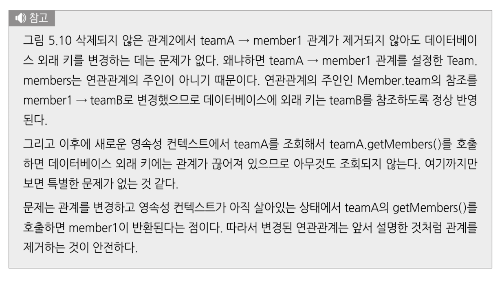
    

## 정리

- 단방향 매핑과 비교해서 양방향 매핑은 복잡
- 연관관계의 주인도 정해야 하고, 두 개의 단방향 연관관계를 양방향으로 만들기 위해 로직도 잘 관리해야 한다.
- 연관관계가 하나인 단방향 매핑은 언제나 연관관계의 주인이라는 점
- 양방향은 여기에 주인이 아닌 연관관계를 하나 추가했을 뿐이다.
- 양방향의 장점은 반대방향으로 객체 그래프 탐색 기능이 추가된 것뿐이다.
    
    
    
- 주인의 반대편은 mappedBy로 주인을 지정해야 한다.
- 주인의 반대편은 단순히 보여주는 일(객체 그래프 탐색)만 할 수 있다.
- 내용 정리
    - 단방향 매핑만으로 테이블과 객체의 연관관계 매핑은 이미 완료
    - 단방향을 양방향으로 만들면 반대방향으로 객체 그래프 탐색 기능이 추가된다.
    - 양방향 연관관계를 매핑하려면 객체에서 양쪽 방향을 모두 관리해야 한다.
- 연관관계의 주인을 정하는 기준
    - 단방향은 항상 외래 키가 있는 곳을 기준으로 매핑하면 된다.
    - 양방향은 연관관계의 주인(Owner)이라는 이름으로 인해 오해가 있을 수 있다.
    - 비즈니스 로직상 더 중요하다고 연관관계의 주인으로 선택하면 안 된다.
    - 비즈니스 중요도를 배제하고 단순히 외래 키 관리자 정도의 의미만 부여해야 한다.
    - 연관관계의 주인은 단순히 외래 키를 매핑한 바퀴를 선택하면 된다.
    - 연관관계의 주인은 외래 키의 위치와 관련해서 정해야지 비즈니스 중요도록 접근하면 안 된다.
        
        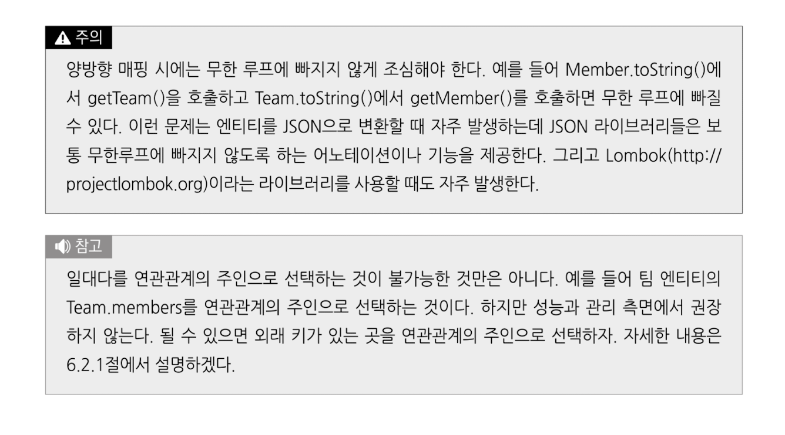
        

[실전예제, 연관관계 매핑 시작](https://www.notion.so/1ba477401a828082846eee085fe5ce47?pvs=21)